<!--
  Pyetro Schumann — GitHub Profile README
  Keep the assets/hero.svg file beside this README when publishing.
-->

<div align="center">
  
</div>

<div align="center">
  <a href="https://git.io/typing-svg">
    
  </a>
</div>

<p align="center">
  <a href="https://github.com/pyetroschumann18">
    
  </a>
  
  
</p>

<p align="center">
  <strong>Web Developer focused on creating modern, performant and useful products.</strong>
</p>

<br/>

## `> whoami`

```ts
const pyetro = {
  role: "Web Developer",
  location: "Brazil 🇧🇷",

  mission: "Turn business ideas into products people enjoy using.",

  focus: [
    "Frontend Development",
    "Backend Development",
    "Software Architecture",
    "AI-assisted Development"
  ],

  building: ["Afinity-Car", "MOV Digital"],

  values: [
    "Useful over flashy",
    "Clarity over complexity",
    "Performance by default",
    "Build, understand, test, improve"
  ]
} as const;
```

<br/>

## ⚡ Technologies I use

<div align="center">

### Frontend


### Backend & Data


### Tools & Workflow


</div>

<br/>

## 💜 Currently building

<table>
  <tr>
    <td width="50%" valign="top">
      <h3>🚗 Afinity-Car</h3>
      <p>A digital product built around a real use case, combining thoughtful interfaces, reliable data and a smooth user experience.</p>
      <p><strong>Product • Frontend • Backend • UX</strong></p>
    </td>
    <td width="50%" valign="top">
      <h3>🚀 MOV Digital</h3>
      <p>Modern, conversion-focused websites and digital experiences for small businesses and entrepreneurs.</p>
      <p><strong>Web • Automation • Performance • Conversion</strong></p>
    </td>
  </tr>
</table>

At **MOV Digital**, I work across the product cycle: responsive interfaces, frontend and backend structure, UX/UI improvements, databases, automations and deployment.

<br/>

## 🧠 What I am improving now

<p align="center">
  
  
  
  
  
  
  
  
</p>

<br/>

## 📊 GitHub analytics

<div align="center">
  
  
</div>

<div align="center">
  
</div>

<br/>

## 📈 Contribution timeline

<div align="center">
  
</div>

<div align="center">
  
</div>

<br/>

## 🌎 Let's build something useful

<p align="center">
  I enjoy turning rough ideas into reliable digital experiences.<br/>
  If the project needs clear interfaces, solid structure and attention to detail, I am interested.
</p>

<p align="center">
  <a href="https://github.com/pyetroschumann18">
    
  </a>
</p>

<br/>

<div align="center">
  <sub><strong>Build. Understand. Test. Improve.</strong></sub>
</div>


